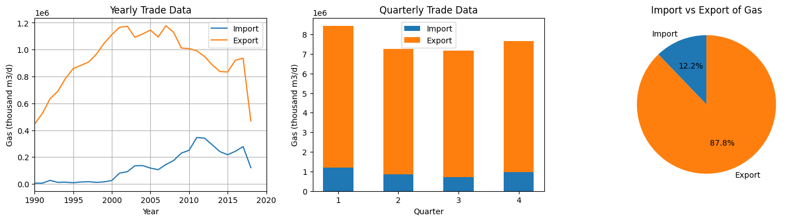
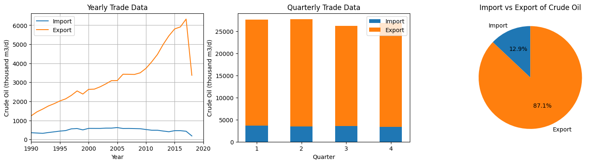
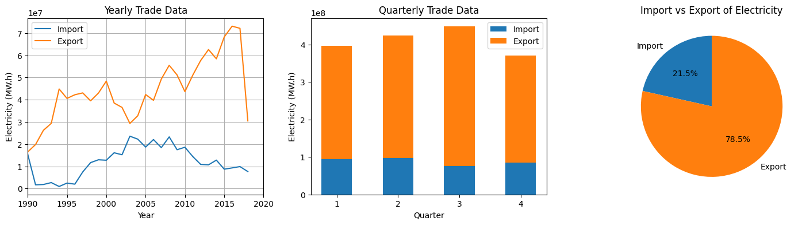
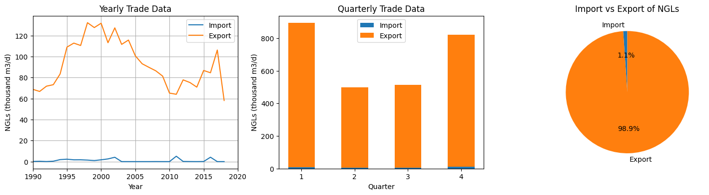

# Canadian Energy Trade Analysis: Imports, Exports, and Market Trends

## Overview
This project analyzes Canadian energy trade data, focusing on imports, exports, and market trends in the oil and gas sector. The dataset includes transactional details such as product type, units, transport mode, and values, which are used to uncover insights into the flow of energy commodities in Canada.

## Project Objectives
- Clean and preprocess the dataset to filter out specific transactional activities and confidential values.
- Segment and organize data based on the year, quarter, and various product categories.
- Analyze import/export volumes of energy products, particularly focusing on the flow of natural gas and oil.
- Visualize trends using various plots to highlight yearly and quarterly trade volumes.
- Evaluate import vs export data and understand the broader market trends.

## Key Steps
1. **Data Cleaning**: Filter out specific activities (such as imports/re-exports) and confidential values.
2. **Data Segmentation**: Split columns to extract year and quarter details, and standardize product information.
3. **Data Analysis**: Group the data by product type and units, calculating total import and export volumes.
4. **Visualization**: Create plots showing the trends in energy trade, including:
   - Yearly import/export volumes
   - Quarterly import/export volumes
   - Import vs export distribution pie chart.

## Functions
- **groupSize(data, colval)**: Returns the count of records for each unique value in the specified column.
- **groupSum(data, colval, sumval)**: Returns the sum of a given column (e.g., value) grouped by a specified column (e.g., year).
- **filterData(df, prod, unit)**: Filters the dataset based on the product type, unit, and year (from 1990 onwards).
- **volPlot(Product, Unit)**: Generates plots for visualizing import and export volumes of a specific product, including yearly trends, quarterly trends, and import vs export pie charts.

## Libraries Used
- **pandas**: For data manipulation and preprocessing.
- **matplotlib**: For creating visualizations and plots.
- **numpy**: For numerical operations and handling missing data.

## Dataset
The dataset used contains the following columns:
- **Product**: Type of energy product (e.g., NGLs, oil, gas).
- **Product Subtype/Category/Commodity**: More specific classification of the product.
- **Mode of transportation**: Transportation methods used.
- **Origin/Destination**: Locations related to the trade.
- **Port**: Port through which the commodity was traded.
- **Activity**: Type of trade activity (e.g., export, import).
- **Units**: Measurement units for quantities (e.g., thousand m3/d).
- **Value**: The monetary value of the transaction.

## Visualizations

### Gas Trade Analysis

### Crude Oil Trade Analysis

### Electricity Trade Analysis

### NGL Trade Analysis

## Future Work
- Expand the analysis to include other energy products.
- Incorporate additional external data sources, such as pricing trends or global energy demand.
- Explore machine learning techniques to predict future trends in Canadian energy trade.
